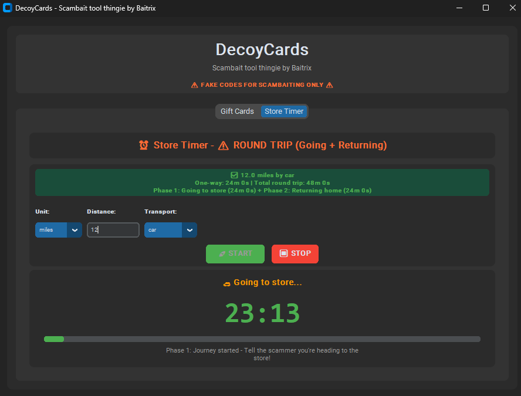
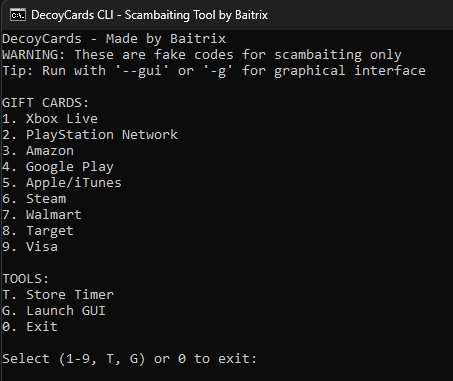

# DecoyCards
Scambaiting tool thingie by Baitrix

Generate fake gift card codes to waste scammers' time. These codes look real but are completely fake and worthless.

This would have been a website if I had the money to host one lmao

**WARNING: These are FAKE codes only for scambaiting. Never try to redeem them on real websites.**

## Easy Setup

1. Download this as a ZIP file and extract it
2. Double-click `setup.bat` (Windows) or run `setup.sh` (Mac/Linux)  
3. Double-click `start_gui.bat` for the easy interface OR `start_cli.bat` for the menu version

## What This Thing Does

Makes fake gift card codes that look real but don't work. Perfect for wasting scammers' time when they ask for gift cards.

### Gift Card Types
- Xbox Live, PlayStation, Amazon, Google Play, Apple/iTunes, Steam, Walmart, Target, Visa
- Codes look exactly like real ones but are completely fake
- Pick how many you want (CLI asks you, GUI has a number box)
- Copy codes easily with one click in the GUI

### Store Timer (The Good Stuff)
This pretends you're going to the store to buy gift cards - super useful for phone scambaiting:
- Enter how far the store is OR just put in your own time
- Timer counts down for "going to store" then "coming back home" 
- Makes sounds and pops up when timer finishes
- Can generate gift cards right when you "reach" the store

## Screenshots

### GUI Gift Cards Tab


### GUI Timer Tab  


### CLI Menu


## How to Use It

### Easy GUI Way (Recommended)
1. Double-click `start_gui.bat` 
2. **Gift Cards tab**: Pick Xbox/Amazon/whatever, set how many, click the button
3. **Store Timer tab**: Enter distance or time, click START TIMER
4. Copy codes with the little copy button

### Command Line Way
1. Double-click `start_cli.bat`
2. Pick a number for the gift card type
3. Type how many you want
4. Or press T for the store timer

You can also run it manually:
```
python gift_card_generator.py       (opens the menu)
python gift_card_generator.py --gui (opens the GUI version)
```

## What You Need

- Python 3.7 or newer (the setup script installs everything else)
- **Windows, macOS, or Linux** (Windows is the only tested one for now)

## Community & Support

Need help or just want to hang out with other scambaiters? Join our Discord server:

**🎮 [Join the Discord Community](https://discord.gg/tvJcK47Vvm) 🎮**

If you like this tool, please:
- ⭐ **Star this repository** 
- 💬 **Join our Discord** for updates, help, and chatting with other scambaiters

## Important Stuff

- **These codes are FAKE** - they won't work on real websites
- Only use this for scambaiting (wasting scammers' time)
- Test codes first to make sure they're invalid

Made specifically for scambaiters to fight back against gift card scammers.
